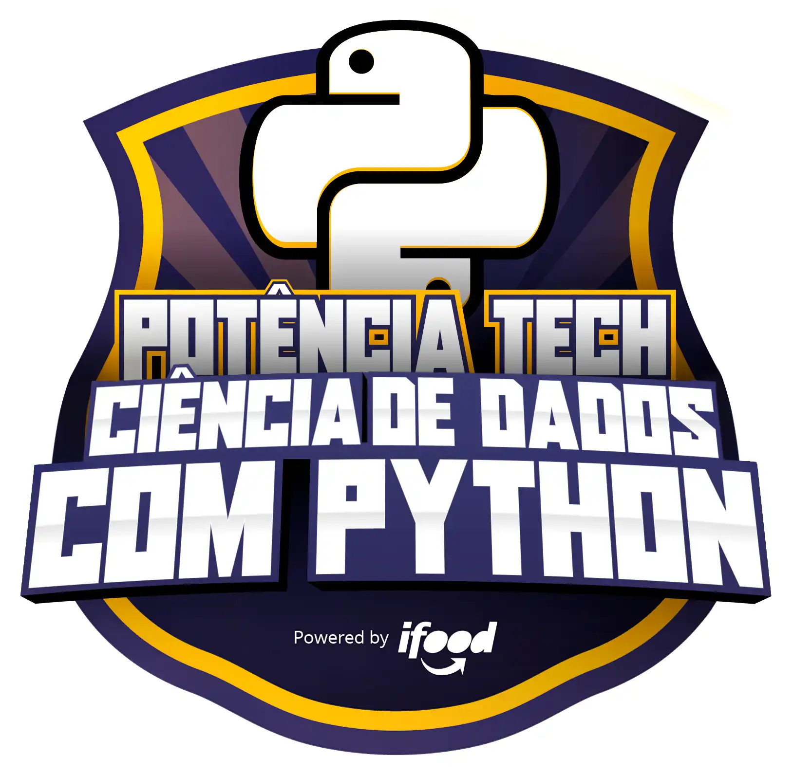

# Bootcamp Potência Tech powered by iFood | Ciência de Dados

O Bootcamp traz os princípios da Ciência de Dados, utilizando Python, uma das linguagens de programação mais utilizadas por cientistas de dados, por meio de cursos, desafios de projeto e desafios de código. 

## Atividades

- Aulas conceituais abordando os principais ferramentas de python.

- Aulas conceituais sobre Modelagem de Dados e projetos práticos com SQL.

- Aulas conceituais sobre fundamentos de ETL (Extract, Transform, Load) com Python.

- Aulas conceituais sobre Machine Learning.
- Aulas conceituais sobre Redes Neurais Artificiais. 

- Mentorias (Ao Vivo): Momento em que você vai se inspirar nos talentos das empresas mais inovadoras do mundo, podendo interagir durante toda a live e até tirar dúvidas sobre carreira e tecnologia.

- Code Challenge: Coloque em prática todo o conhecimento adquirido nas aulas e teste seus conhecimentos na resolução de um desafio.

- Desafio de Projeto: Monte seu portfólio construindo projetos práticos com os conhecimentos adquiridos ao longo das aulas.

- Ranking: Cada bootcamp possui um ranking com premiações exclusivas, onde você pontua de acordo com as interações que realiza nos Fóruns e Salas, os acertos que obtém nos quizzes e a qualidade do código que desenvolve nos desafios.